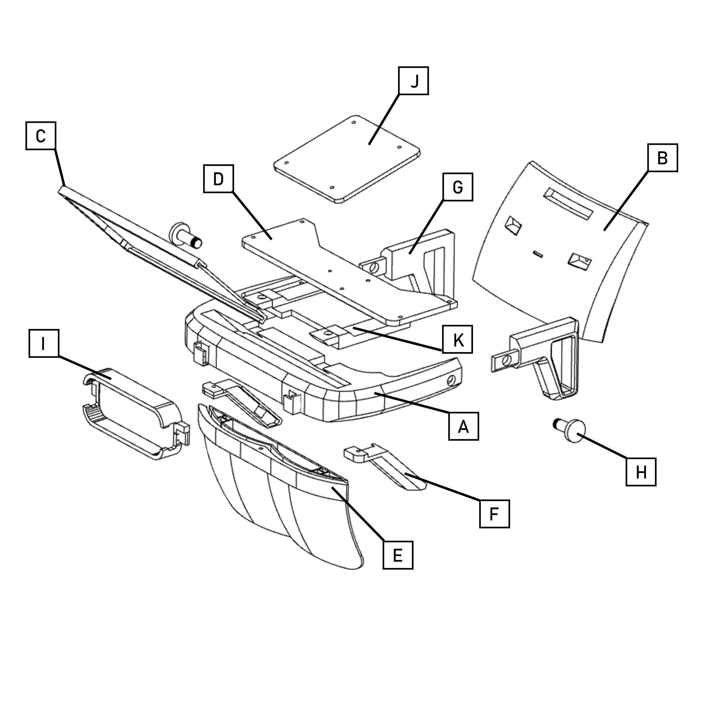

# Triton Project : Mechanical

# Components
This the offical list of designated component names used to assemble the Triton.

- A. Halo
- B. Head press
- C. Display tray
- D. Top cover
- E. Lens attacher
- F. Display brackets
- G. Strap holders
- H. Peg and bolt
- I. Leap Motion case
- J. LCD Driver Mount
- K. Rosen bridge